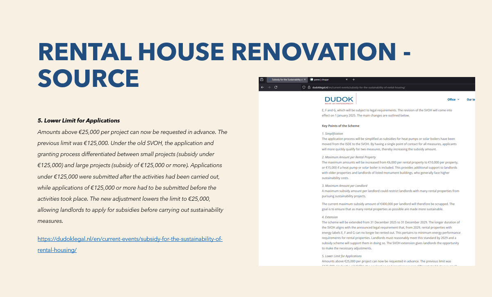
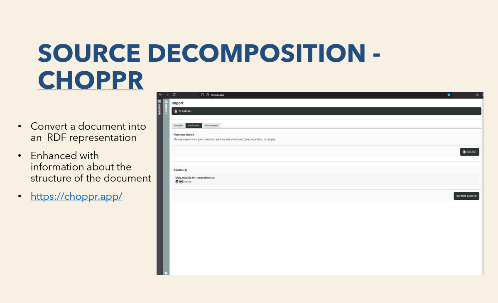
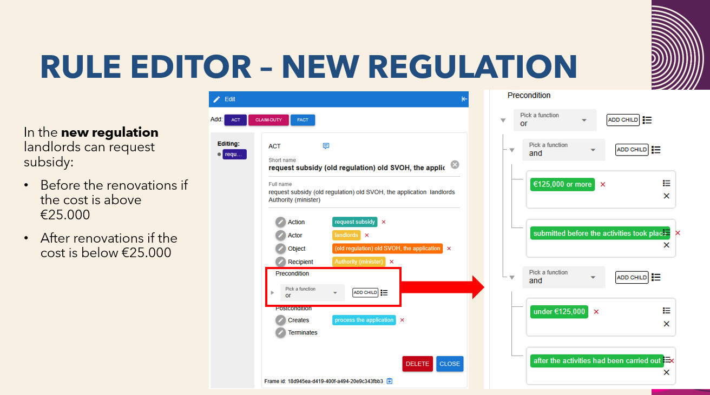

# MOOI project

This is a repository for material produced/used by the University of Amsterdam team, regarding the MOOI project. 

## Norm editor demonstration (FLINT)

This is a demonstration of how can natural language text be translated into FLINT specification. This demonstration uses an example of regulations about rental house renovation subsidies (according to this [blogpost](https://dudoklegal.nl/en/current-events/subsidy-for-the-sustainability-of-rental-housing/)). This process uses the [choppr](https://choppr.app/) and [norm editor](https://rule-editor.netlify.app/) web tools. 

Presentation: [pdf](material\FLINT_editor_demo\FLINT_demo_renovation_rental.pdf) or [pptx](material\FLINT_editor_demo\FLINT_demo_renovation_rental.pptx)

[Raw material](material\FLINT_editor_demo\more_resources)

*Figure 1: The scenario used in the demonstration ([source](https://dudoklegal.nl/en/current-events/subsidy-for-the-sustainability-of-rental-housing/))*

*Figure 2: The [choppr](https://choppr.app/) tool*

*Figure 3: Specification on the [rule editor](https://rule-editor.netlify.app/)*